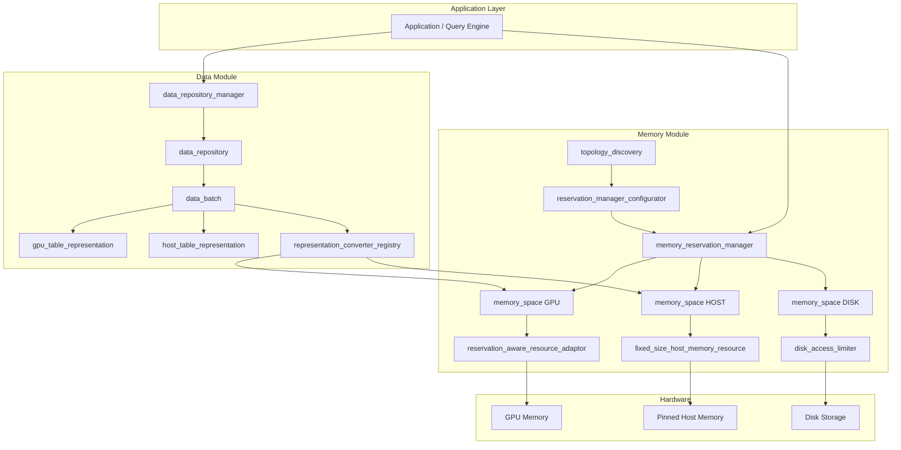
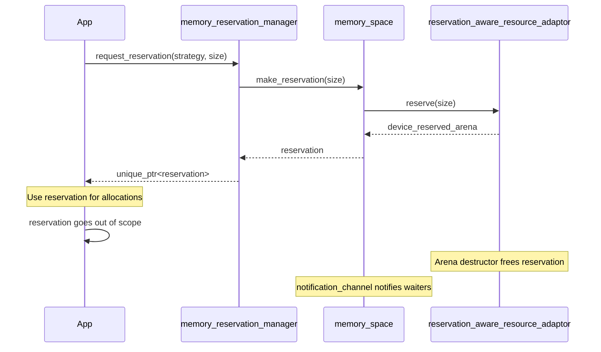
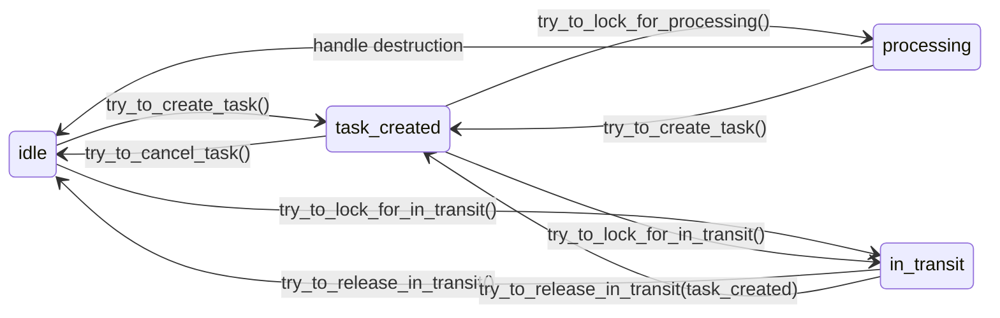

# Architecture Overview

A high-level description of cuCascade's design, core components, and how they work together.

## Table of Contents

- [Overview](#overview)
- [System Architecture](#system-architecture)
- [Memory Tier System](#memory-tier-system)
- [Core Components](#core-components)
  - [Memory Reservation Manager](#memory-reservation-manager)
  - [Memory Spaces](#memory-spaces)
  - [Reservation System](#reservation-system)
  - [Data Batch Lifecycle](#data-batch-lifecycle)
  - [Data Repositories](#data-repositories)
  - [Representation Converter](#representation-converter)
  - [Topology Discovery](#topology-discovery)
- [End-to-End Data Flow](#end-to-end-data-flow)
- [Thread Safety Model](#thread-safety-model)
- [Design Patterns](#design-patterns)
- [Key Source Files](#key-source-files)

---

## Overview

cuCascade is a GPU memory management library for data-intensive applications that need to process more data than fits in GPU memory. It solves a fundamental problem: GPU memory is fast but limited, while host memory and disk are larger but slower.

Rather than failing when GPU memory runs out, cuCascade provides:

- **Tiered memory** -- seamlessly allocate across GPU, pinned host, and disk storage
- **Reservation-based allocation** -- prevent GPU oversubscription by reserving memory upfront
- **Automatic data movement** -- move data between tiers based on configurable pressure thresholds
- **Hardware-aware placement** -- discover NUMA topology and place memory optimally
- **Safe concurrent access** -- state machine and RAII handles protect data during multi-threaded processing

## System Architecture



## Memory Tier System

cuCascade organizes memory into three tiers, each with different performance and capacity characteristics:

| Tier | Backing | Speed | Capacity | Allocator |
|------|---------|-------|----------|-----------|
| **GPU** | Device VRAM | Fastest | Limited (8-80 GB typical) | `reservation_aware_resource_adaptor` |
| **HOST** | Pinned CPU RAM | Medium | Large (64-512 GB typical) | `fixed_size_host_memory_resource` |
| **DISK** | NVMe/SSD | Slowest | Very large (TB+) | `disk_access_limiter` |

Each tier is identified by a `memory_space_id` -- a `(Tier, device_id)` pair. For example, GPU device 0 is `(GPU, 0)`, NUMA node 1's host memory is `(HOST, 1)`.

Data flows downward (GPU -> HOST -> DISK) when memory pressure is high (**downgrade**), and upward (DISK -> HOST -> GPU) when data is needed for processing (**upgrade**).

---

## Core Components

### Memory Reservation Manager

**File**: `include/cucascade/memory/memory_reservation_manager.hpp`

The `memory_reservation_manager` is the central coordinator for all memory operations. It owns all `memory_space` instances and provides a strategy-based interface for requesting memory reservations.

```cpp
// Request 1GB on any available GPU
auto reservation = manager.request_reservation(
    any_memory_space_in_tier(Tier::GPU), 1ULL << 30);

// Request on a specific host NUMA node
auto host_res = manager.request_reservation(
    specific_memory_space(Tier::HOST, 0), 2ULL << 30);
```

**Reservation request strategies** (Strategy pattern):

| Strategy | Behavior |
|----------|----------|
| `any_memory_space_in_tier(tier)` | Any space in the given tier |
| `any_memory_space_in_tier_with_preference(tier, device)` | Preferred device, falls back to others |
| `specific_memory_space(tier, device)` | Exact memory space, no fallback |
| `any_memory_space_in_tiers(tiers)` | Try tiers in preference order |
| `any_memory_space_to_downgrade(src, target_tier)` | Find a target for spilling data down |
| `any_memory_space_to_upgrade(src, target_tier)` | Find a target for promoting data up |

If no space can satisfy a request, the manager blocks on a condition variable until memory is freed.

### Memory Spaces

**File**: `include/cucascade/memory/memory_space.hpp`

A `memory_space` represents a single memory location (e.g., one GPU, one NUMA node, one disk mount). It holds:

- A tier-specific **allocator** (the actual memory resource)
- A **reservation allocator** that tracks and enforces reservations
- A **stream pool** for CUDA stream management
- A **notification channel** for signaling when memory is freed
- **Downgrade thresholds** controlling when data should be moved to a slower tier

```
memory_space (GPU, device 0)
├── allocator: rmm::cuda_async_memory_resource
├── reservation_allocator: reservation_aware_resource_adaptor
├── stream_pool: exclusive_stream_pool (16 streams)
├── notification_channel: shared_ptr<notification_channel>
├── capacity: 8 GB
├── reservation_limit: 6.8 GB (85%)
├── downgrade_trigger: 6.8 GB (85%)
└── downgrade_stop: 5.2 GB (65%)
```

### Reservation System

**File**: `include/cucascade/memory/memory_reservation.hpp`

Reservations guarantee that a certain amount of memory is available before any allocation happens. This prevents GPU oversubscription in multi-tenant scenarios.



**Reservation limit policies** control what happens when an allocation exceeds its stream's reservation:

| Policy | Behavior |
|--------|----------|
| `fail_reservation_limit_policy` | Throws `rmm::out_of_memory` (default) |
| `ignore_reservation_limit_policy` | Allows over-reservation (soft limits) |
| `increase_reservation_limit_policy` | Auto-grows reservation by 1.25x padding |

### Data Batch Lifecycle

**File**: `include/cucascade/data/data_batch.hpp`

A `data_batch` is the fundamental unit of data in cuCascade. It wraps a tier-specific data representation (GPU table or host table) and manages concurrent access through a state machine.



**States**:
- **idle** -- no pending work, available for scheduling or tier movement
- **task_created** -- a task has been registered but processing hasn't started
- **processing** -- one or more RAII `data_batch_processing_handle`s are active
- **in_transit** -- locked for movement between memory tiers (no concurrent access)

The `data_batch_processing_handle` uses RAII to ensure the processing count is always correctly decremented, even on exceptions.

### Data Repositories

**File**: `include/cucascade/data/data_repository.hpp`

A `data_repository` is a partitioned storage for data batches. It provides blocking `pop` operations that wait until a batch reaches the requested state.

```cpp
// Pop a batch that can transition to task_created (blocks if none ready)
auto batch = repository.pop_data_batch(batch_state::task_created);

// Pop a specific batch by ID
auto batch = repository.pop_data_batch_by_id(42, batch_state::in_transit);
```

The `data_repository_manager` coordinates multiple repositories across operators/pipelines and provides atomic batch ID generation.

### Representation Converter

**File**: `include/cucascade/data/representation_converter.hpp`

The `representation_converter_registry` provides type-indexed conversion between data representations. Converters are registered as functions keyed by `(source_type, target_type)`.

**Built-in converters**:

| Source | Target | Method |
|--------|--------|--------|
| GPU table | Host table | `cudf::pack()` -> `cudaMemcpyAsync` (D2H) -> multi-block host allocation |
| Host table | GPU table | `cudaMemcpyAsync` (H2D) -> `cudf::unpack()` on device |
| GPU table | GPU table | `cudf::pack()` -> `cudaMemcpyPeerAsync` -> `cudf::unpack()` (cross-device) |
| Host table | Host table | Block-by-block `std::memcpy` (cross-NUMA) |

### Topology Discovery

**File**: `include/cucascade/memory/topology_discovery.hpp`

The `topology_discovery` class detects the hardware layout at runtime using NVML (loaded dynamically via `dlopen`) and the `/sys` filesystem. It discovers:

- GPU devices with PCIe bus IDs and UUIDs
- NUMA node assignments for each GPU
- CPU core affinity per GPU
- Network devices (InfiniBand/RoCE NICs) with NUMA affinity
- Storage devices (NVMe, SATA SSD/HDD) with NUMA affinity
- PCIe path types between devices (PIX, PXB, PHB, NODE, SYS)

This information feeds into `reservation_manager_configurator` to automatically bind host memory spaces to the correct NUMA nodes for each GPU.

---

## End-to-End Data Flow

A typical lifecycle of data through cuCascade:

```
1. INGESTION
   Create data representation (e.g., gpu_table_representation wrapping a cuDF table)
   -> Wrap in data_batch with unique ID from data_repository_manager
   -> Add to data_repository

2. TASK SCHEDULING
   batch.try_to_create_task()              [idle -> task_created]
   repository.pop_data_batch(task_created) [retrieve batch for processing]

3. PROCESSING
   batch.try_to_lock_for_processing()      [task_created -> processing]
   -> Returns data_batch_processing_handle (RAII)
   -> Access data via batch.get_data()
   -> Handle destructs on scope exit       [processing -> idle]

4. MEMORY PRESSURE (downgrade)
   memory_space.should_downgrade_memory()  [threshold exceeded]
   batch.try_to_lock_for_in_transit()      [idle -> in_transit]
   converter_registry.convert<host_table_representation>(...)
   batch.set_data(new_representation)      [data now on HOST]
   batch.try_to_release_in_transit()       [in_transit -> idle]

5. DATA NEEDED (upgrade)
   Same flow as downgrade but in reverse tier direction

6. CLEANUP
   manager.clear_all_repositories()        [verify all batches consumed]
```

---

## Thread Safety Model

cuCascade uses a strict lock hierarchy to prevent deadlocks:

```
Level 1: atomic<uint64_t> (batch ID generation -- lock-free)
    |
Level 2: data_batch._mutex (protects state machine)
    |
Level 3: idata_repository._mutex (protects batch storage)
    |
Level 4: data_repository_manager._mutex (protects repository map)
    |
Level 5: representation_converter_registry._mutex (protects converter map)
    |
Level 6: memory_reservation_manager._wait_mutex (protects reservation waiting)
```

Key synchronization primitives:
- **`std::mutex`** -- guards state transitions, storage, and configuration
- **`std::condition_variable`** -- blocks repository pops and reservation requests until satisfied
- **`std::atomic`** -- lock-free counters for batch IDs, allocated bytes, and peak tracking
- **`atomic_bounded_counter`** -- CAS-based bounded arithmetic for reservation enforcement
- **`notification_channel`** -- signals waiting threads when reservations are released

---

## Design Patterns

| Pattern | Where Used |
|---------|-----------|
| **Strategy** | `reservation_request_strategy` subclasses for memory selection |
| **Builder** | `reservation_manager_configurator` for fluent system configuration |
| **RAII** | `data_batch_processing_handle`, `borrowed_stream`, `multiple_blocks_allocation`, `notify_on_exit` |
| **Factory** | `DeviceMemoryResourceFactoryFn` for tier-specific allocator creation |
| **Adapter** | `reservation_aware_resource_adaptor` wraps RMM resources with tracking |
| **State Machine** | `data_batch` with explicit states and guarded transitions |
| **Observer** | `notification_channel` / `event_notifier` for memory release signaling |
| **Type-Indexed Registry** | `representation_converter_registry` keyed by `(source_type, target_type)` |
| **Variant** | `memory_space_config` for tier-specific configuration, `reserving_adaptor_type` for allocators |

---

## Key Source Files

### Memory Module

| File | Purpose |
|------|---------|
| `include/cucascade/memory/common.hpp` | `Tier` enum, `memory_space_id`, factory functions |
| `include/cucascade/memory/config.hpp` | Configuration structs for GPU, HOST, DISK |
| `include/cucascade/memory/memory_reservation_manager.hpp` | Central reservation coordinator and strategies |
| `include/cucascade/memory/memory_space.hpp` | Per-location memory container |
| `include/cucascade/memory/memory_reservation.hpp` | Reservation objects, arenas, and limit policies |
| `include/cucascade/memory/reservation_aware_resource_adaptor.hpp` | GPU allocator with per-stream tracking |
| `include/cucascade/memory/fixed_size_host_memory_resource.hpp` | Block-based pinned host allocator |
| `include/cucascade/memory/disk_access_limiter.hpp` | Disk tier reservation tracker |
| `include/cucascade/memory/topology_discovery.hpp` | NVML-based hardware topology detection |
| `include/cucascade/memory/reservation_manager_configurator.hpp` | Builder for system configuration |
| `include/cucascade/memory/notification_channel.hpp` | Cross-reservation signaling |
| `include/cucascade/memory/stream_pool.hpp` | CUDA stream pool with RAII borrowing |
| `include/cucascade/memory/oom_handling_policy.hpp` | OOM handling strategies |
| `include/cucascade/memory/error.hpp` | Custom error types and exceptions |
| `include/cucascade/memory/numa_region_pinned_host_allocator.hpp` | NUMA-aware pinned host allocation |
| `include/cucascade/memory/host_table.hpp` | Serialized cuDF table storage on host |
| `include/cucascade/memory/null_device_memory_resource.hpp` | No-op resource for disk tier |

### Data Module

| File | Purpose |
|------|---------|
| `include/cucascade/data/common.hpp` | `idata_representation` interface |
| `include/cucascade/data/data_batch.hpp` | Batch lifecycle, state machine, processing handles |
| `include/cucascade/data/data_repository.hpp` | Partitioned batch storage with blocking pops |
| `include/cucascade/data/data_repository_manager.hpp` | Multi-pipeline repository coordination |
| `include/cucascade/data/representation_converter.hpp` | Type-indexed converter registry |
| `include/cucascade/data/gpu_data_representation.hpp` | GPU-resident cuDF table wrapper |
| `include/cucascade/data/cpu_data_representation.hpp` | Host-resident multi-block table wrapper |
| `include/cucascade/utils/atomics.hpp` | `atomic_peak_tracker`, `atomic_bounded_counter` |
| `include/cucascade/utils/overloaded.hpp` | Variant visitor helper |
