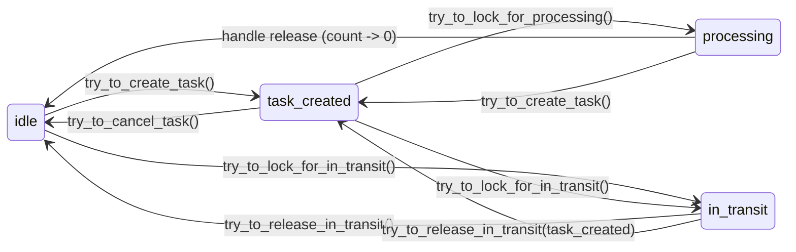
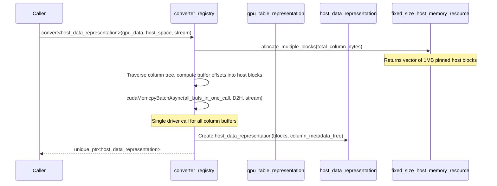
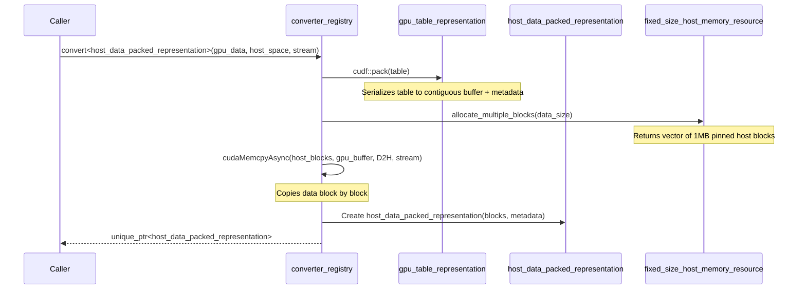

# Data Management

A deep dive into cuCascade's data lifecycle, batch state machine, repositories, and representation conversion.

## Table of Contents

- [Overview](#overview)
- [Data Representations](#data-representations)
  - [Interface: idata_representation](#interface-idata_representation)
  - [GPU Table Representation](#gpu-table-representation)
  - [Host Table Representation (Direct Copy)](#host-table-representation-direct-copy)
  - [Host Table Representation (Packed)](#host-table-representation-packed)
- [Data Batch Lifecycle](#data-batch-lifecycle)
  - [States](#states)
  - [State Transitions](#state-transitions)
  - [Processing Handles](#processing-handles)
  - [Thread Safety](#thread-safety)
  - [Cloning](#cloning)
- [Representation Conversion](#representation-conversion)
  - [Converter Registry](#converter-registry)
  - [Built-in Converters](#built-in-converters)
  - [Conversion Flow](#conversion-flow)
- [Data Repositories](#data-repositories)
  - [Add and Pop Semantics](#add-and-pop-semantics)
  - [Partitioning](#partitioning)
  - [shared_ptr vs unique_ptr Repositories](#shared_ptr-vs-unique_ptr-repositories)
- [Data Repository Manager](#data-repository-manager)
  - [Operator Port Keys](#operator-port-keys)
  - [Batch ID Generation](#batch-id-generation)
  - [Multi-Repository Distribution](#multi-repository-distribution)
- [Integration with Memory Module](#integration-with-memory-module)
- [Key Source Files](#key-source-files)

---

## Overview

The data module manages the lifecycle of data as it flows through processing pipelines and moves between memory tiers. It provides:

- **Tier-agnostic data representations** -- abstract interface with GPU and host implementations
- **State machine for batch lifecycle** -- prevents concurrent access conflicts during processing and tier movement
- **Type-indexed conversion** -- extensible registry for converting data between representations
- **Partitioned repositories** -- thread-safe storage with blocking retrieval
- **Multi-pipeline coordination** -- manages data across operators with atomic ID generation

The data module depends on the memory module for allocators, memory spaces, and CUDA streams.

## Data Representations

### Interface: idata_representation

**File**: `include/cucascade/data/common.hpp`

All data in cuCascade is accessed through the `idata_representation` interface:

```cpp
class idata_representation {
public:
    virtual std::size_t get_size_in_bytes() const = 0;
    virtual std::unique_ptr<idata_representation> clone(rmm::cuda_stream_view stream) = 0;

    template <class TargetType>
    TargetType& cast();  // Unsafe downcast (no dynamic_cast overhead)

    Tier get_current_tier() const;
    int get_device_id() const;
    memory_space& get_memory_space() const;
};
```

Data representations are thin wrappers -- they hold the data but delegate storage details (tier, device, allocator) to their associated `memory_space`.

### GPU Table Representation

**File**: `include/cucascade/data/gpu_data_representation.hpp`

Wraps a `cudf::table` residing in GPU device memory:

```cpp
class gpu_table_representation : public idata_representation {
    std::unique_ptr<cudf::table> _table;

public:
    const cudf::table& get_table() const;
    std::unique_ptr<cudf::table> release_table();  // Transfer ownership

    std::size_t get_size_in_bytes() const override;
    std::unique_ptr<idata_representation> clone(rmm::cuda_stream_view stream) override;
};
```

- `clone()` performs a deep copy using `cudf::table(table.view(), stream)`
- Owns the `cudf::table` object but not the underlying GPU memory (managed by the allocator)

### Host Table Representation (Direct Copy)

**File**: `include/cucascade/data/cpu_data_representation.hpp`

The preferred host representation. Directly copies each column's GPU device buffers into pinned
host memory without an intermediate GPU-side contiguous allocation. Column layout is described by
custom per-column `column_metadata` structs, enabling reconstruction without cudf's pack format.

```cpp
class host_data_representation : public idata_representation {
    std::unique_ptr<memory::host_table_allocation> _host_table;

public:
    const std::unique_ptr<memory::host_table_allocation>& get_host_table() const;

    std::size_t get_size_in_bytes() const override;
    std::unique_ptr<idata_representation> clone(rmm::cuda_stream_view stream) override;
};
```

A `host_table_allocation` (`include/cucascade/memory/host_table.hpp`) contains:
- `allocation` -- `multiple_blocks_allocation` (vector of fixed-size pinned memory blocks)
- `columns` -- per-column `column_metadata` trees describing buffer offsets, sizes, and nesting
- `data_size` -- total bytes stored across all blocks

Each `column_metadata` node captures `type_id`, `num_rows`, `null_count`, `scale` (for decimals),
plus buffer offsets/sizes for the null mask and data buffer, and recursive `children` for nested
types (LIST, STRUCT, STRING, DICTIONARY32).

This representation avoids the extra GPU allocation and GPU-to-GPU copy that `cudf::pack` performs.
`cudaMemcpyBatchAsync` is used to transfer all column buffers in a single driver call per direction,
achieving ~99% of raw PCIe bandwidth even with multiple concurrent threads.

`clone()` copies data block-by-block with `std::memcpy` and duplicates the column metadata tree.

### Host Table Representation (Packed)

**File**: `include/cucascade/data/cpu_data_representation.hpp`

A legacy representation that uses `cudf::pack()` to serialize the table to a contiguous GPU buffer
before copying it to host memory. Useful when cudf's serialization format is required.

```cpp
class host_data_packed_representation : public idata_representation {
    std::unique_ptr<memory::host_table_packed_allocation> _host_table;

public:
    const std::unique_ptr<memory::host_table_packed_allocation>& get_host_table() const;

    std::size_t get_size_in_bytes() const override;
    std::unique_ptr<idata_representation> clone(rmm::cuda_stream_view stream) override;
};
```

A `host_table_packed_allocation` (`include/cucascade/memory/host_table_packed.hpp`) contains:
- `allocation` -- `multiple_blocks_allocation` (vector of fixed-size pinned memory blocks)
- `metadata` -- serialized cuDF table metadata from `cudf::pack()` (for reconstruction via `cudf::unpack()`)
- `data_size` -- actual data size in bytes

`clone()` copies data block-by-block with `std::memcpy` and duplicates the metadata vector.

---

## Data Batch Lifecycle

### States

**File**: `include/cucascade/data/data_batch.hpp`

A `data_batch` wraps a data representation and controls access through four states:

| State | Meaning |
|-------|---------|
| `idle` | No pending tasks, no active processing. Available for scheduling or tier movement. |
| `task_created` | A task has been registered (`_task_created_count > 0`) but processing hasn't started. |
| `processing` | One or more `data_batch_processing_handle`s are active (`_processing_count > 0`). |
| `in_transit` | Locked for movement between memory tiers. No concurrent access allowed. |

### State Transitions



**Key rules**:
- `try_to_create_task()` can stack -- `_task_created_count` can be > 1
- `try_to_lock_for_processing()` validates memory space matches and decrements `_task_created_count`
- Multiple processing handles can coexist (concurrent reads)
- `in_transit` blocks all other operations (exclusive lock for tier movement)
- `try_to_lock_for_in_transit()` fails if `_processing_count > 0` (must wait for processing to finish)

**Disallowed transitions**:

| Attempt | From State | Failure Reason |
|---------|-----------|----------------|
| `try_to_create_task()` | `in_transit` | Returns `false` |
| `try_to_lock_for_in_transit()` | `processing` | Returns `false` |
| `try_to_lock_for_processing()` | `idle` | Status: `task_not_created` |
| `try_to_lock_for_processing()` | wrong memory space | Status: `memory_space_mismatch` |
| `try_to_lock_for_processing()` | no data | Status: `missing_data` |

See [data_batch_state_transitions.md](data_batch_state_transitions.md) for the complete reference.

### Processing Handles

The `data_batch_processing_handle` is an RAII guard that decrements the processing count when destroyed:

```cpp
auto result = batch.try_to_lock_for_processing(memory_space_id);
if (result.success) {
    // result.handle is a data_batch_processing_handle
    auto& data = batch.get_data()->cast<gpu_table_representation>();
    process(data.get_table());
    // handle destructs here -> processing_count--
    // if count reaches 0: processing -> idle (or task_created if tasks pending)
}
```

Properties:
- **Move-only** -- prevents accidental copies that would corrupt the count
- **Multiple handles** -- concurrent processing is supported (shared read access)
- **Scope-safe** -- count is decremented even if an exception is thrown

### Thread Safety

Each `data_batch` is protected by a `std::mutex`. State transitions are guarded by the mutex, and an optional `std::condition_variable` is notified after each state change (used by repositories to unblock waiting pops).

### Cloning

```cpp
auto cloned = batch.clone(new_batch_id, stream);
```

Cloning creates a task, locks for processing, clones the underlying data representation, then releases the lock. The cloned batch starts in `idle` state with the new ID.

---

## Representation Conversion

### Converter Registry

**File**: `include/cucascade/data/representation_converter.hpp`

The `representation_converter_registry` stores conversion functions indexed by `(source_type, target_type)`:

```cpp
// Register a custom converter
registry.register_converter<gpu_table_representation, host_data_representation>(
    [](idata_representation& source, const memory_space* target, rmm::cuda_stream_view stream)
        -> std::unique_ptr<idata_representation> {
        // Convert GPU table to host (direct copy)
        return ...;
    }
);

// Convert data
auto host_data = registry.convert<host_data_representation>(
    *gpu_data, target_host_space, stream);
```

The registry is thread-safe (all operations guarded by `std::mutex`).

### Built-in Converters

Registered via `register_builtin_converters()`:

| Source | Target | Method |
|--------|--------|--------|
| `gpu_table_representation` | `host_data_representation` | `cudaMemcpyBatchAsync` (D2H) — copies each column's buffers directly to pinned host blocks; ~99% PCIe bandwidth |
| `host_data_representation` | `gpu_table_representation` | Allocates `rmm::device_buffer` per column buffer, `cudaMemcpyBatchAsync` (H2D), reconstructs `cudf::column` tree |
| `gpu_table_representation` | `host_data_packed_representation` | `cudf::pack()` on GPU -> `cudaMemcpyAsync` (D2H) to multi-block host allocation |
| `host_data_packed_representation` | `gpu_table_representation` | `cudaMemcpyAsync` (H2D) from host blocks -> `cudf::unpack()` on device |
| `gpu_table_representation` | `gpu_table_representation` | `cudf::pack()` -> `cudaMemcpyPeerAsync` -> `cudf::unpack()` (cross-device copy) |
| `host_data_packed_representation` | `host_data_packed_representation` | Block-by-block `std::memcpy` + metadata copy (cross-NUMA copy) |

### Conversion Flow

GPU to HOST (direct copy — preferred):



GPU to HOST (packed — uses cudf serialization):



---

## Data Repositories

**File**: `include/cucascade/data/data_repository.hpp`

### Add and Pop Semantics

A repository is a thread-safe, partitioned queue of data batches:

```cpp
// Add a batch (sets its CV for state change notifications)
repository.add_data_batch(std::move(batch), partition_idx);

// Pop first batch that can transition to target state (BLOCKS if none ready)
auto batch = repository.pop_data_batch(batch_state::task_created, partition_idx);

// Pop specific batch by ID (returns nullptr if not found)
auto batch = repository.pop_data_batch_by_id(42, batch_state::in_transit, partition_idx);

// Non-removing access (shared_ptr repositories only)
auto batch = repository.get_data_batch_by_id(42, batch_state::task_created, partition_idx);
```

Pop behavior by target state:
- `task_created` -- calls `try_to_create_task()` on each batch until one succeeds
- `in_transit` -- calls `try_to_lock_for_in_transit()` on each batch
- `processing` -- **throws** (must create task first, then lock for processing separately)
- `idle` -- always returns `false` (terminal state, not a valid pop target)

### Partitioning

Repositories use `std::vector<std::vector<PtrType>>` for partitioned storage. Each partition is an independent FIFO queue:

```cpp
// Partition 0: pipeline A data
repository.add_data_batch(batch_a, 0);

// Partition 1: pipeline B data
repository.add_data_batch(batch_b, 1);

// Pop from partition 0 only
auto batch = repository.pop_data_batch(batch_state::task_created, 0);
```

### shared_ptr vs unique_ptr Repositories

| Type | Alias | Use Case |
|------|-------|----------|
| `idata_repository<shared_ptr<data_batch>>` | `shared_data_repository` | Same batch shared across multiple repositories (fan-out) |
| `idata_repository<unique_ptr<data_batch>>` | `unique_data_repository` | Each batch owned by exactly one repository |

Key difference: `get_data_batch_by_id()` (non-removing access) is only available with `shared_ptr` repositories.

---

## Data Repository Manager

**File**: `include/cucascade/data/data_repository_manager.hpp`

### Operator Port Keys

Repositories are indexed by `(operator_id, port_id)` pairs:

```cpp
// Add repositories for different operators
manager.add_new_repository(0, "output", std::make_unique<shared_data_repository>());
manager.add_new_repository(1, "input", std::make_unique<shared_data_repository>());
manager.add_new_repository(1, "output", std::make_unique<shared_data_repository>());

// Access a specific repository
auto& repo = manager.get_repository(1, "input");
```

### Batch ID Generation

The manager provides globally unique, monotonically increasing batch IDs:

```cpp
uint64_t id = manager.get_next_data_batch_id();  // atomic increment
```

### Multi-Repository Distribution

The `add_data_batch()` method distributes a batch to one or more repositories:

```cpp
// shared_ptr: same batch goes to multiple repositories
manager.add_data_batch(shared_batch, {{0, "output"}, {1, "input"}});

// unique_ptr: batch goes to exactly one repository (throws if multiple specified)
manager.add_data_batch(std::move(unique_batch), {{1, "input"}});
```

The manager also provides `get_data_batches_for_downgrade()` to find batches eligible for tier demotion based on their memory space.

---

## Integration with Memory Module

The data and memory modules are connected at several points:

1. **Memory spaces** -- each `idata_representation` holds a reference to its `memory_space`, which provides tier, device ID, and allocator access

2. **Stream acquisition** -- data operations use `memory_space.acquire_stream()` for CUDA async operations

3. **Reservation tracking** -- when data is converted between tiers, the converter allocates in the target memory space using its allocator and reservation system

4. **Downgrade coordination** -- the application queries `memory_space.should_downgrade_memory()` and uses `data_repository_manager.get_data_batches_for_downgrade()` to find candidates

5. **Processing validation** -- `try_to_lock_for_processing()` checks that the requested `memory_space_id` matches the batch's current location

```
Application
    |
    |-- memory_reservation_manager.request_reservation(strategy, size)
    |       |-- memory_space.make_reservation(size)
    |
    |-- data_repository_manager.add_data_batch(batch, ops)
    |       |-- data_repository.add_data_batch(batch)
    |
    |-- data_repository.pop_data_batch(task_created)
    |       |-- data_batch.try_to_create_task()
    |
    |-- data_batch.try_to_lock_for_processing(memory_space_id)
    |       |-- validates memory_space match
    |       |-- returns processing_handle (RAII)
    |
    |-- [on memory pressure]
    |   data_batch.try_to_lock_for_in_transit()
    |   converter_registry.convert(data, target_space, stream)
    |       |-- allocates in target memory_space
    |       |-- cudaMemcpy between tiers
    |   data_batch.set_data(new_representation)
    |   data_batch.try_to_release_in_transit()
```

---

## Key Source Files

| File | Purpose |
|------|---------|
| `include/cucascade/data/common.hpp` | `idata_representation` abstract interface |
| `include/cucascade/data/data_batch.hpp` | `data_batch`, `batch_state`, `data_batch_processing_handle` |
| `include/cucascade/data/data_repository.hpp` | `idata_repository<PtrType>`, `shared_data_repository`, `unique_data_repository` |
| `include/cucascade/data/data_repository_manager.hpp` | `data_repository_manager`, `operator_port_key` |
| `include/cucascade/data/representation_converter.hpp` | `representation_converter_registry`, `converter_key` |
| `include/cucascade/data/gpu_data_representation.hpp` | `gpu_table_representation` wrapping `cudf::table` |
| `include/cucascade/data/cpu_data_representation.hpp` | `host_data_representation` (direct buffer copy) and `host_data_packed_representation` (cudf::pack) |
| `include/cucascade/memory/host_table.hpp` | `host_table_allocation` and `column_metadata` for direct-copy host representations |
| `include/cucascade/memory/host_table_packed.hpp` | `host_table_packed_allocation` for packed (cudf::pack) host representations |
| `include/cucascade/utils/atomics.hpp` | `atomic_peak_tracker`, `atomic_bounded_counter` |
| `include/cucascade/utils/overloaded.hpp` | Variant visitor helper |
| `docs/data_batch_state_transitions.md` | Complete state machine reference |
