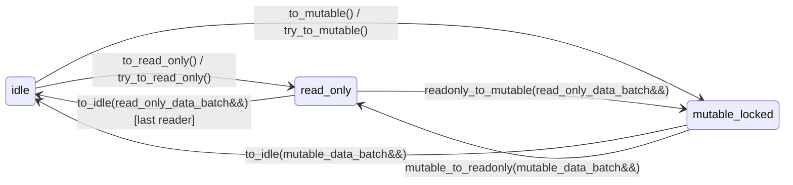

# Data Management

A deep dive into cuCascade's data lifecycle, batch read-only and mutable locking accessor classes, repositories, and representation conversion.

## Table of Contents

- [Overview](#overview)
- [Data Representations](#data-representations)
  - [Interface: idata_representation](#interface-idata_representation)
  - [Concrete Representations](#concrete-representations)
- [Data Batch Lifecycle](#data-batch-lifecycle)
  - [States](#states)
  - [State Transitions](#state-transitions)
  - [Processing Handles](#processing-handles)
  - [Thread Safety](#thread-safety)
  - [Cloning](#cloning)
- [Representation Conversion](#representation-conversion)
  - [Converter Registry](#converter-registry)
- [Data Repositories](#data-repositories)
  - [Add and Pop Semantics](#add-and-pop-semantics)
  - [Partitioning](#partitioning)
  - [shared_ptr vs unique_ptr Repositories](#shared_ptr-vs-unique_ptr-repositories)
- [Data Repository Manager](#data-repository-manager)
  - [Operator Port Keys](#operator-port-keys)
  - [Batch ID Generation](#batch-id-generation)
  - [Multi-Repository Distribution](#multi-repository-distribution)
- [Integration with Memory Module](#integration-with-memory-module)
- [Key Source Files](#key-source-files)

---

## Overview

The data module manages the lifecycle of data as it flows through processing pipelines and moves between memory tiers. It provides:

- **Tier-agnostic data representations** -- abstract interface; cuCascade ships the disk representation in-library, while GPU/host representations are provided by the domain layer
- **Locking read-only and mutable accessor classes for batch lifecycle** -- prevents concurrent access conflicts during processing and tier movement
- **Type-indexed conversion** -- extensible registry for converting data between representations
- **Partitioned repositories** -- thread-safe storage with blocking retrieval
- **Multi-pipeline coordination** -- manages data across operators with atomic ID generation

The data module depends on the memory module for allocators, memory spaces, and CUDA streams.

## Data Representations

### Interface: idata_representation

**File**: `include/cucascade/data/common.hpp`

All data in cuCascade is accessed through the `idata_representation` interface:

```cpp
class idata_representation {
public:
    virtual std::size_t get_size_in_bytes() const = 0;
    virtual std::unique_ptr<idata_representation> clone(rmm::cuda_stream_view stream) = 0;

    template <class TargetType>
    TargetType& cast();  // Unsafe downcast (no dynamic_cast overhead)

    Tier get_current_tier() const;
    int get_device_id() const;
    memory_space& get_memory_space() const;
};
```

Data representations are thin wrappers -- they hold the data but delegate storage details (tier, device, allocator) to their associated `memory_space`.

The interface also declares `record_writer_event(stream)` and `get_writer_event()` as base virtuals with no-op / `nullptr` defaults, used for cross-stream / cross-device synchronization. Representations whose memory is produced asynchronously on a CUDA stream (e.g. GPU representations in the domain layer) override them.

### Concrete Representations

cuCascade is independent of libcudf and ships exactly **one** concrete representation in-library:
`disk_data_representation` (`include/cucascade/data/disk_data_representation.hpp`), which persists a
serialized table to disk and reads it back via the disk I/O backends (kvikIO / GDS / pipeline).

GPU and host representations -- which wrap concrete column types such as `cudf::table` -- are **not**
part of the core library. They are provided by an external **domain layer** that links cuCascade and
libcudf, derive from `idata_representation`, and are wired into the conversion pipeline at runtime via
`representation_converter_registry::register_converter<Source, Target>()`.

Column buffer layout for tier transfers and disk storage is described by the generic, domain-agnostic
`memory::column_metadata` (`include/cucascade/memory/column_metadata.hpp`). Each node captures an
opaque `type_id` tag (the numeric value of a consumer's column-type enum, e.g. `cudf::type_id`, which
cuCascade never interprets), `num_rows`, `null_count`, `scale` (for decimals), buffer offsets/sizes for
the null mask and data buffer, and recursive `children` for nested types. The disk tier's
`disk_table_allocation` (`include/cucascade/memory/disk_table.hpp`) holds a
`std::vector<memory::column_metadata>`.

---

## Data Batch Lifecycle

### States

**File**: `include/cucascade/data/data_batch.hpp`

A `data_batch` wraps a data representation and controls access through three states using a
reader-writer lock model. Data is only accessible through RAII accessor objects that hold the
appropriate lock — the idle `data_batch` pointer grants no data access.

| State | Meaning |
|-------|---------|
| `idle` | No active locks. Available for reading, mutation, or tier movement. |
| `read_only` | One or more `read_only_data_batch` shared locks are active (`_read_only_count > 0`). Concurrent readers allowed; exclusive access blocked. |
| `mutable_locked` | One `mutable_data_batch` exclusive lock is active. No concurrent readers; full read/write access. |

### State Transitions


```mermaid
stateDiagram-v2
    direction LR

    idle --> read_only : to_read_only() / try_to_read_only()
    idle --> mutable_locked : to_mutable() / try_to_mutable()

    read_only --> idle : to_idle(read_only_data_batch&&) [last reader]
    read_only --> mutable_locked : readonly_to_mutable(read_only_data_batch&&)

    mutable_locked --> idle : to_idle(mutable_data_batch&&)
    mutable_locked --> read_only : mutable_to_readonly(mutable_data_batch&&)
```

**Key rules**:
- Non-static transitions (`to_read_only`, `to_mutable`, `try_to_*`) use `shared_from_this()` and do not consume the caller's `shared_ptr`.
- Static transitions (`to_idle`, `readonly_to_mutable`, `mutable_to_readonly`) consume the accessor via `&&`, making the source null at the call site — the compiler enforces that you cannot use an accessor after releasing it.
- `to_read_only()` / `to_mutable()` **block** until the lock is available.
- `try_to_read_only()` / `try_to_mutable()` are **non-blocking** and return `std::nullopt` on failure.
- Multiple `read_only_data_batch` handles may coexist on the same batch (concurrent reads).
- `mutable_data_batch` is exclusive: it cannot coexist with any other reader or writer.
- Copying a `read_only_data_batch` acquires a new shared lock on the parent, incrementing `_read_only_count`.

See [data_batch_state_transitions.md](data_batch_state_transitions.md) for the complete reference.

### RAII Accessor Classes

Access to batch data is only possible through one of two RAII accessor classes:

**`read_only_data_batch`** — shared (read) lock:

```cpp
// Acquire shared lock (blocks if exclusive lock held)
read_only_data_batch ro = batch->to_read_only();

// Access data (cast to the concrete representation registered by your domain layer)
auto& data = ro.get_data()->cast<DomainGpuRepresentation>();
process(data);

// Release: either let ro go out of scope, or explicitly return to idle
auto idle_batch = cucascade::data_batch::to_idle(std::move(ro));
```

Properties:
- **Copyable** — each copy acquires a new shared lock; `_read_only_count` increments per copy.
- **Movable** — moves transfer lock ownership without changing the count.
- Destruction or `to_idle()` decrements `_read_only_count`; the batch returns to `idle` when the count reaches zero.

**`mutable_data_batch`** — exclusive (write) lock:

```cpp
// Acquire exclusive lock (blocks until all readers and writers release)
mutable_data_batch mut = batch->to_mutable();

// Read and write data
mut.set_data(std::move(new_representation));

// Release back to idle
auto idle_batch = cucascade::data_batch::to_idle(std::move(mut));
```

Properties:
- **Move-only** — no copies allowed; only one exclusive lock can exist at a time.
- Destruction or `to_idle()` releases the exclusive lock.

**Upgrade / Downgrade**:

```cpp
// Upgrade: shared → exclusive (releases shared, acquires exclusive — may block)
mutable_data_batch mut = cucascade::data_batch::readonly_to_mutable(std::move(ro));

// Downgrade: exclusive → shared (releases exclusive, acquires shared — may block)
read_only_data_batch ro2 = cucascade::data_batch::mutable_to_readonly(std::move(mut));
```

### Thread Safety

Each `data_batch` uses a `std::shared_mutex`: shared locks for readers (`read_only_data_batch`) and unique locks for writers (`mutable_data_batch`). The observable state (`batch_state` enum) is tracked atomically so it can be queried without acquiring the mutex. `_read_only_count` is also atomic for lock-free reader-count queries.

### Subscriber Counting

Independent of the locking model, batches support a subscriber reference count:

```cpp
batch->subscribe();          // Increment interest count (lock-free)
batch->unsubscribe();        // Decrement interest count (lock-free)
batch->get_subscriber_count(); // Query count (lock-free)
```

This is used by the pipeline and downgrade executor to track which batches are still of interest, independently of whether they are currently locked.

### Cloning

```cpp
// Via read-only accessor (caller already holds lock)
read_only_data_batch ro = batch->to_read_only();
auto cloned = ro.clone(new_batch_id, stream);

// With representation conversion (target type registered by your domain layer)
auto cloned = ro.clone_to<DomainHostRepresentation>(registry, new_batch_id, host_space, stream);
```

Cloning produces a new `shared_ptr<data_batch>` in `idle` state with the given ID. The clone
contains a deep copy of the data representation, residing in the same memory space as the original
(or a different space when using `clone_to`).

---

## Representation Conversion

### Converter Registry

**File**: `include/cucascade/data/representation_converter.hpp`

The `representation_converter_registry` stores conversion functions indexed by `(source_type, target_type)`:

```cpp
// Register a custom converter (SourceRep / TargetRep are concrete representations
// derived from idata_representation, typically provided by the domain layer)
registry.register_converter<SourceRep, TargetRep>(
    [](idata_representation& source, const memory_space* target, rmm::cuda_stream_view stream)
        -> std::unique_ptr<idata_representation> {
        // Build the target representation from the source
        return ...;
    }
);

// Convert data
auto converted = registry.convert<TargetRep>(*source_data, target_space, stream);
```

The registry is thread-safe (all operations guarded by `std::mutex`).

cuCascade ships **no** built-in converters -- the registry starts empty. Consumers (the domain
layer that links libcudf) register the converters they need at runtime via `register_converter()`.
At convert time the registry looks up the function keyed by `{typeid(source), typeid(target)}` and
invokes it; the registry itself is representation-agnostic and never names or interprets concrete
types.

---

## Data Repositories

**File**: `include/cucascade/data/data_repository.hpp`

### Add and Pop Semantics

A repository is a thread-safe, partitioned queue of idle `data_batch` pointers. It does not
perform any locking or state transitions — callers are responsible for acquiring the appropriate
`read_only_data_batch` or `mutable_data_batch` accessor after popping.

```cpp
// Add a batch (idle state)
repository.add_data_batch(batch_ptr, partition_idx);

// Pop the next batch from a partition (non-blocking; returns nullptr if empty)
auto batch = repository.pop_next_data_batch(partition_idx);
if (batch) {
    auto ro = batch->to_read_only();   // acquire shared lock
    process(ro.get_data());
}

// Pop a specific batch by ID (returns nullptr if not found)
auto batch = repository.pop_data_batch_by_id(batch_id, partition_idx);

// Non-removing access — read pointer without dequeuing (shared_ptr repos only)
auto batch = repository.get_data_batch_by_id(batch_id, partition_idx);
```

`pop_next_data_batch` is **non-blocking** — it returns `nullptr` immediately if the partition is
empty. Callers poll or check `empty()` / `total_size()` to determine whether to wait.

### Partitioning

Repositories use `std::vector<std::vector<PtrType>>` for partitioned storage. Each partition is an independent FIFO queue:

```cpp
// Partition 0: pipeline A data
repository.add_data_batch(batch_a, 0);

// Partition 1: pipeline B data
repository.add_data_batch(batch_b, 1);

// Pop from partition 0 only
auto batch = repository.pop_data_batch(batch_state::task_created, 0);
```

### shared_ptr vs unique_ptr Repositories

| Type | Alias | Use Case |
|------|-------|----------|
| `idata_repository<shared_ptr<data_batch>>` | `shared_data_repository` | Same batch shared across multiple repositories (fan-out) |
| `idata_repository<unique_ptr<data_batch>>` | `unique_data_repository` | Each batch owned by exactly one repository |

Key difference: `get_data_batch_by_id()` (non-removing access) is only available with `shared_ptr` repositories.

---

## Data Repository Manager

**File**: `include/cucascade/data/data_repository_manager.hpp`

### Operator Port Keys

Repositories are indexed by `(operator_id, port_id)` pairs:

```cpp
// Add repositories for different operators
manager.add_new_repository(0, "output", std::make_unique<shared_data_repository>());
manager.add_new_repository(1, "input", std::make_unique<shared_data_repository>());
manager.add_new_repository(1, "output", std::make_unique<shared_data_repository>());

// Access a specific repository
auto& repo = manager.get_repository(1, "input");
```

### Batch ID Generation

The manager provides globally unique, monotonically increasing batch IDs:

```cpp
uint64_t id = manager.get_next_data_batch_id();  // atomic increment
```

### Multi-Repository Distribution

The `add_data_batch()` method distributes a batch to one or more repositories:

```cpp
// shared_ptr: same batch goes to multiple repositories
manager.add_data_batch(shared_batch, {{0, "output"}, {1, "input"}});

// unique_ptr: batch goes to exactly one repository (throws if multiple specified)
manager.add_data_batch(std::move(unique_batch), {{1, "input"}});
```

The manager also provides `get_data_batches_for_downgrade()` to find batches eligible for tier demotion based on their memory space.

---

## Integration with Memory Module

The data and memory modules are connected at several points:

1. **Memory spaces** -- each `idata_representation` holds a reference to its `memory_space`, which provides tier, device ID, and allocator access

2. **Stream acquisition** -- data operations use `memory_space.acquire_stream()` for CUDA async operations

3. **Reservation tracking** -- when data is converted between tiers, the converter allocates in the target memory space using its allocator and reservation system

4. **Downgrade coordination** -- the application queries `memory_space.should_downgrade_memory()` and uses `data_repository_manager.get_data_batches_for_downgrade()` to find candidates

5. **Processing validation** -- `try_to_lock_for_processing()` checks that the requested `memory_space_id` matches the batch's current location

```
Application
    |
    |-- memory_reservation_manager.request_reservation(strategy, size)
    |       |-- memory_space.make_reservation(size)
    |
    |-- data_repository_manager.add_data_batch(batch, ops)
    |       |-- data_repository.add_data_batch(batch)   [batch is idle]
    |
    |-- data_repository.pop_next_data_batch(partition_idx)
    |       |-- returns shared_ptr<data_batch> (idle, non-blocking)
    |
    |-- batch->to_read_only()                           [shared lock]
    |       |-- returns read_only_data_batch (blocks until available)
    |       |-- ro.get_data() grants read access to idata_representation
    |
    |-- [on memory pressure]
    |   mutable_data_batch mut = data_batch::readonly_to_mutable(std::move(ro))
    |   mut.convert_to<TargetRepresentation>(registry, target_space, stream)
    |       |-- converter_registry.convert(data, target_space, stream)
    |       |-- allocates in target memory_space
    |       |-- cudaMemcpy between tiers
    |   data_batch::to_idle(std::move(mut))             [release exclusive lock]
```

---

## Key Source Files

| File | Purpose |
|------|---------|
| `include/cucascade/data/common.hpp` | `idata_representation` abstract interface |
| `include/cucascade/data/data_batch.hpp` | `data_batch`, `read_only_data_batch`, `mutable_data_batch`, `batch_state` |
| `include/cucascade/data/data_repository.hpp` | `idata_repository<PtrType>`, `shared_data_repository`, `unique_data_repository` |
| `include/cucascade/data/data_repository_manager.hpp` | `data_repository_manager`, `operator_port_key` |
| `include/cucascade/data/representation_converter.hpp` | `representation_converter_registry`, `converter_key` |
| `include/cucascade/data/disk_data_representation.hpp` | `disk_data_representation` (the only in-library concrete representation) |
| `include/cucascade/memory/column_metadata.hpp` | `memory::column_metadata` generic columnar buffer-layout descriptor |
| `include/cucascade/utils/atomics.hpp` | `atomic_peak_tracker`, `atomic_bounded_counter` |
| `include/cucascade/utils/overloaded.hpp` | Variant visitor helper |
| `docs/data_batch_state_transitions.md` | Complete state machine reference |
