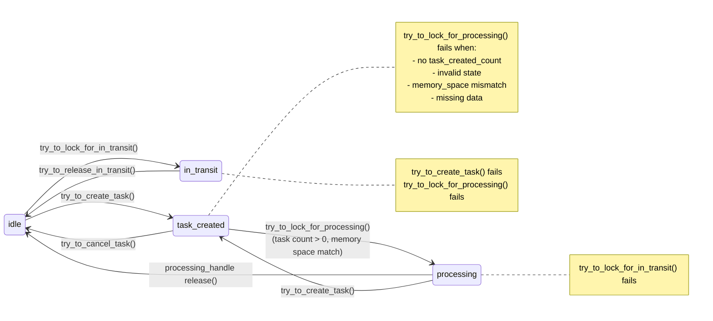

## data_batch State Transitions

This document summarizes how a `data_batch` moves between lifecycle states and the methods that trigger each transition. State changes are always synchronized via the batch mutex; some transitions also notify a condition variable if one is set through `set_state_change_cv`.

### States
- `idle`: No pending task or processing; not in transit.
- `task_created`: A task has been registered but not yet processing.
- `processing`: One or more processing handles are active.
- `in_transit`: The batch is locked for movement between memory tiers.

### Allowed transitions

| From | To | Trigger | Notes |
| --- | --- | --- | --- |
| idle | task_created | `try_to_create_task()` | Increments `_task_created_count`. |
| idle | in_transit | `try_to_lock_for_in_transit()` | Requires `_processing_count == 0`. |
| task_created | processing | `try_to_lock_for_processing(...)` | Requires `_task_created_count > 0` and valid memory-space match. Decrements `_task_created_count`, increments `_processing_count`. |
| task_created | idle | `try_to_cancel_task()` | Decrements `_task_created_count`; if it reaches zero and no processing, returns to idle. |
| processing | idle | `data_batch_processing_handle` destruction or `release()` | Decrements `_processing_count`; when it reaches zero, transitions to idle. |
| processing | task_created | `try_to_create_task()` | Allowed; bumps `_task_created_count` while staying in processing. |
| in_transit | idle | `try_to_release_in_transit()` | Unlocks transit and returns to idle. |

### Disallowed transitions (failures)
- `try_to_lock_for_processing(...)` when:
  - `_task_created_count == 0` → status `task_not_created`
  - State is not `task_created` or `processing` → status `invalid_state`
  - Memory space mismatch → status `memory_space_mismatch`
  - No underlying data → status `missing_data`
- `try_to_create_task()` when state is `in_transit` → returns false.
- `try_to_lock_for_in_transit()` when state is `task_created` or `processing` → returns false.
- `try_to_cancel_task()` outside `task_created`/`processing` → returns false.

### Notifications
When a transition changes state, the stored condition variable (if any) is notified after releasing the mutex.

### Diagram

