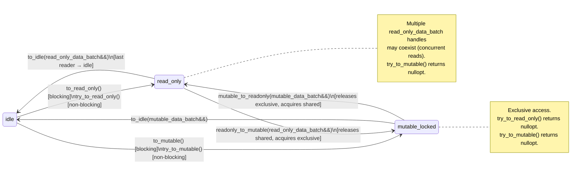

## data_batch State Transitions

This document is the complete reference for how a `data_batch` moves between lifecycle states
and which methods trigger each transition. State changes are enforced by a `std::shared_mutex`;
observable state is tracked atomically in `_state`.

### States

| State | Description |
|-------|-------------|
| `idle` | No active locks. The batch is available for reading, mutation, or representation conversion. |
| `read_only` | One or more `read_only_data_batch` shared locks are active (`_read_only_count > 0`). Concurrent readers allowed; exclusive access blocked. |
| `mutable_locked` | One `mutable_data_batch` exclusive lock is active. No concurrent readers. Full read/write access to the data representation. |

### Accessor Classes

Data is only accessible through RAII accessor objects; the idle `shared_ptr<data_batch>` grants
no access to the underlying data.

| Class | Lock type | Copyable | Notes |
|-------|-----------|----------|-------|
| `read_only_data_batch` | Shared (`std::shared_lock`) | Yes — each copy acquires a new shared lock | `_read_only_count` increments per instance |
| `mutable_data_batch` | Exclusive (`std::unique_lock`) | No | Only one can exist at a time |

### Allowed Transitions

#### Non-static (via `shared_from_this` — caller's `shared_ptr` is NOT consumed)

| From | To | Method | Blocking |
|------|----|--------|----------|
| `idle` | `read_only` | `to_read_only()` | Yes — blocks until shared lock available |
| `idle` | `read_only` | `try_to_read_only()` | No — returns `std::nullopt` if exclusive lock held |
| `idle` | `mutable_locked` | `to_mutable()` | Yes — blocks until exclusive lock available |
| `idle` | `mutable_locked` | `try_to_mutable()` | No — returns `std::nullopt` if any lock held |

#### Static (consume accessor via `&&` — source is left null)

| From | To | Method | Blocking | Notes |
|------|----|--------|----------|-------|
| `read_only` | `idle` | `to_idle(read_only_data_batch&&)` | No | Returns `shared_ptr<data_batch>`; state becomes `idle` when last reader releases |
| `mutable_locked` | `idle` | `to_idle(mutable_data_batch&&)` | No | Releases exclusive lock; returns `shared_ptr<data_batch>` |
| `read_only` | `mutable_locked` | `readonly_to_mutable(read_only_data_batch&&)` | Yes — blocks until exclusive lock available | Releases shared lock first, then acquires exclusive |
| `mutable_locked` | `read_only` | `mutable_to_readonly(mutable_data_batch&&)` | Yes — blocks until shared lock available | Releases exclusive lock first, then acquires shared |

### Disallowed / Non-Transitions

- `try_to_read_only()` returns `std::nullopt` when a `mutable_data_batch` is active (exclusive lock held).
- `try_to_mutable()` returns `std::nullopt` when any lock is held (shared or exclusive).
- `to_read_only()` and `to_mutable()` on a batch not managed by `shared_ptr` throw `std::bad_weak_ptr` (they require `shared_from_this()`).

### Subscriber Counting

Independent of the locking model, a batch maintains an atomic subscriber interest count:

| Method | Effect |
|--------|--------|
| `subscribe()` | Atomically increments `_subscriber_count` |
| `unsubscribe()` | Atomically decrements; throws `std::runtime_error` if already zero |
| `get_subscriber_count()` | Returns current count (lock-free) |
| `get_read_only_count()` | Returns `_read_only_count` — number of active `read_only_data_batch` instances (lock-free) |
| `get_state()` | Returns current `batch_state` (lock-free, `memory_order_relaxed`) |

### Diagram

```mermaid
stateDiagram-v2
    direction LR

    idle --> read_only : to_read_only() [blocking]\ntry_to_read_only() [non-blocking]
    idle --> mutable_locked : to_mutable() [blocking]\ntry_to_mutable() [non-blocking]

    read_only --> idle : to_idle(read_only_data_batch&&)\n[last reader → idle]
    read_only --> mutable_locked : readonly_to_mutable(read_only_data_batch&&)\n[releases shared, acquires exclusive]

    mutable_locked --> idle : to_idle(mutable_data_batch&&)
    mutable_locked --> read_only : mutable_to_readonly(mutable_data_batch&&)\n[releases exclusive, acquires shared]

    note right of read_only
      Multiple read_only_data_batch handles
      may coexist (concurrent reads).
      try_to_mutable() returns nullopt.
    end note

    note right of mutable_locked
      Exclusive access.
      try_to_read_only() returns nullopt.
      try_to_mutable() returns nullopt.
    end note
```
