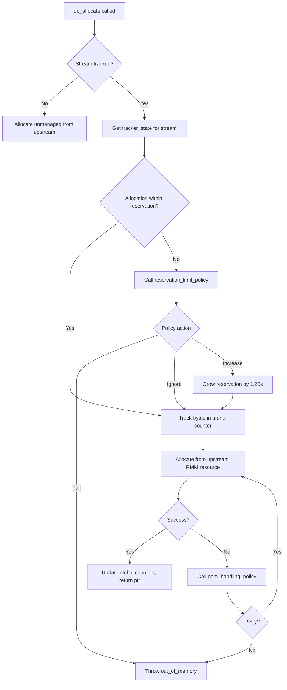

# Memory Management

A deep dive into cuCascade's three-tier memory system, reservation model, and tier-specific allocators.

## Table of Contents

- [Overview](#overview)
- [Memory Tiers](#memory-tiers)
- [Memory Spaces](#memory-spaces)
- [Reservation System](#reservation-system)
  - [Requesting Reservations](#requesting-reservations)
  - [Reserved Arenas](#reserved-arenas)
  - [Reservation Limit Policies](#reservation-limit-policies)
  - [Reservation Lifecycle](#reservation-lifecycle)
- [GPU Memory Management](#gpu-memory-management)
  - [Per-Stream vs Per-Thread Tracking](#per-stream-vs-per-thread-tracking)
  - [Allocation Flow](#allocation-flow)
  - [OOM Handling](#oom-handling)
- [Host Memory Management](#host-memory-management)
  - [Block-Based Allocation](#block-based-allocation)
  - [Pool Expansion](#pool-expansion)
  - [Multi-Block Allocations](#multi-block-allocations)
- [Disk Memory Management](#disk-memory-management)
- [Downgrade and Upgrade Triggers](#downgrade-and-upgrade-triggers)
- [Notification System](#notification-system)
- [Stream Pool](#stream-pool)
- [Key Source Files](#key-source-files)

---

## Overview

The memory module is the foundation of cuCascade. It manages a three-tier memory hierarchy (GPU, HOST, DISK) using **reservation-based allocation** -- callers must reserve memory before allocating, preventing oversubscription and enabling predictable memory management under pressure.

The key abstraction is the `memory_space`, which represents a single memory location (one GPU device, one NUMA host node, or one disk mount). Each memory space has its own allocator, reservation tracking, and downgrade thresholds.

## Memory Tiers

```
┌─────────────────┐
│   GPU (Tier 0)  │  Fastest, smallest capacity
│   Device VRAM   │  reservation_aware_resource_adaptor
├─────────────────┤
│  HOST (Tier 1)  │  Medium speed, medium capacity
│  Pinned CPU RAM │  fixed_size_host_memory_resource
├─────────────────┤
│  DISK (Tier 2)  │  Slowest, largest capacity
│   NVMe / SSD    │  disk_access_limiter
└─────────────────┘
```

| Property | GPU | HOST | DISK |
|----------|-----|------|------|
| `Tier` enum value | `GPU` (0) | `HOST` (1) | `DISK` (2) |
| Backing store | Device VRAM | NUMA-pinned CPU RAM | Filesystem |
| Typical capacity | 8-80 GB | 64-512 GB | 1+ TB |
| Allocator type | `reservation_aware_resource_adaptor` | `fixed_size_host_memory_resource` | `disk_access_limiter` |
| Default allocation | RMM `cuda_async_memory_resource` | NUMA-pinned blocks (1 MB each) | Reservation tracking only |
| Per-stream tracking | Yes | No | No |
| Growable reservations | Yes | Yes | No |
| Upstream resource | RMM async pool | `numa_region_pinned_host_memory_resource` | `null_device_memory_resource` |

Each tier is identified by a `memory_space_id` combining `(Tier, device_id)`. For example:
- `(GPU, 0)` -- first GPU
- `(HOST, 1)` -- host memory on NUMA node 1
- `(DISK, 0)` -- first disk mount

## Memory Spaces

A `memory_space` (defined in `include/cucascade/memory/memory_space.hpp`) is a non-copyable, non-movable container for a single memory location. It is constructed from a tier-specific config struct:

```cpp
// Created internally by memory_reservation_manager
memory_space gpu_space(gpu_memory_space_config{
    .device_id = 0,
    .reservation_limit_fraction = 0.85,
    .downgrade_trigger_fraction = 0.85,
    .downgrade_stop_fraction = 0.65,
    .memory_capacity = 8ULL << 30,  // 8 GB
    .per_stream_reservation = true
});
```

Each memory space holds:

- **Default allocator** (`rmm::mr::device_memory_resource*`) -- the underlying memory resource
- **Reservation allocator** (variant of GPU/HOST/DISK types) -- wraps the default allocator with reservation tracking
- **Stream pool** (`exclusive_stream_pool`) -- pre-allocated CUDA streams for async operations
- **Notification channel** (`shared_ptr<notification_channel>`) -- signals when reservations are freed
- **Thresholds** -- capacity, reservation limit, downgrade trigger, downgrade stop

Key methods:

| Method | Description |
|--------|-------------|
| `make_reservation(size)` | Create exact-size reservation, blocks if at limit |
| `make_reservation_or_null(size)` | Create reservation or return null if unavailable |
| `make_reservation_upto(size)` | Create reservation for as much as available (up to `size`) |
| `acquire_stream()` | Borrow a CUDA stream from the pool |
| `should_downgrade_memory()` | True if usage exceeds downgrade trigger threshold |
| `should_stop_downgrading_memory()` | True if usage is below downgrade stop threshold |
| `get_available_memory()` | Remaining allocatable memory |

---

## Reservation System

### Requesting Reservations

All reservations flow through `memory_reservation_manager::request_reservation()`, which uses the **Strategy pattern** to select a target memory space:

```cpp
auto manager = memory_reservation_manager(configs);

// Strategy 1: Any GPU
auto res = manager.request_reservation(any_memory_space_in_tier(Tier::GPU), 1ULL << 30);

// Strategy 2: Specific NUMA node
auto res = manager.request_reservation(specific_memory_space(Tier::HOST, 0), 2ULL << 30);

// Strategy 3: Try GPU first, fall back to HOST
auto res = manager.request_reservation(
    any_memory_space_in_tiers({Tier::GPU, Tier::HOST}), 512ULL << 20);

// Strategy 4: Downgrade from GPU to HOST
auto res = manager.request_reservation(
    any_memory_space_to_downgrade(gpu_space_id, Tier::HOST), data_size);
```

If no space can satisfy the request, the manager waits on a condition variable until a reservation is released somewhere in the system.

### Reserved Arenas

Each tier has its own `reserved_arena` subclass:

| Arena Type | Tier | Key Feature |
|-----------|------|-------------|
| `device_reserved_arena` | GPU | `atomic_bounded_counter` for per-stream allocation tracking |
| `chunked_reserved_area` | HOST | UUID-based identity, maps to block allocations |
| `disk_reserved_arena` | DISK | Mount path for file-based storage, no grow/shrink |

### Reservation Limit Policies

When an allocation within a stream exceeds its reservation, a `reservation_limit_policy` decides what happens:

```cpp
// Default: throw on over-reservation
auto policy = std::make_unique<fail_reservation_limit_policy>();

// Soft limits: allow over-reservation silently
auto policy = std::make_unique<ignore_reservation_limit_policy>();

// Auto-grow: increase reservation by 1.25x
auto policy = std::make_unique<increase_reservation_limit_policy>(
    1.25,   // padding_factor
    false   // allow_beyond_limit
);
```

### Reservation Lifecycle

```
1. REQUEST    manager.request_reservation(strategy, size)
                 └─> strategy selects memory_space
                 └─> memory_space creates reserved_arena
                 └─> returns unique_ptr<reservation>

2. USE        Allocate memory within the reservation's memory space
                 └─> allocator checks reservation limits
                 └─> policy handles over-reservation

3. RELEASE    reservation goes out of scope (RAII)
                 └─> arena destructor frees reserved bytes
                 └─> notification_channel signals waiters
                 └─> blocked request_reservation() calls unblock
```

---

## GPU Memory Management

**File**: `include/cucascade/memory/reservation_aware_resource_adaptor.hpp`

The `reservation_aware_resource_adaptor` wraps an RMM `device_memory_resource` (typically `cuda_async_memory_resource`) and adds:

1. **Global allocation tracking** -- total allocated bytes across all streams
2. **Per-stream reservation enforcement** -- each stream has its own reservation and policy
3. **Memory limit enforcement** -- hard cap on total allocations
4. **OOM handling** -- pluggable retry policies

### Per-Stream vs Per-Thread Tracking

The adaptor supports two tracking modes via `AllocationTrackingScope`:

| Mode | Class | Use Case |
|------|-------|----------|
| `PER_STREAM` | `stream_ordered_allocation_tracker` | Default. Tracks via `unordered_map<cudaStream_t, state>`. Thread-safe with mutex. |
| `PER_THREAD` | `ptds_allocation_tracker` | Uses `thread_local` storage. No lock needed. For per-thread-default-stream (PTDS) workflows. |

Each tracked stream has a `stream_ordered_tracker_state` containing:
- A `device_reserved_arena` for the stream's reservation
- A `reservation_limit_policy` for handling over-reservation
- An `oom_handling_policy` for handling allocation failures

### Allocation Flow



### OOM Handling

The `oom_handling_policy` interface provides a hook for custom recovery:

```cpp
struct oom_handling_policy {
    using RetryFunc = std::function<void*(std::size_t, rmm::cuda_stream_view)>;

    void* handle_oom(std::size_t bytes, rmm::cuda_stream_view stream,
                     std::exception_ptr eptr, RetryFunc retry_function);
};
```

The default `throw_on_oom_policy` simply rethrows the exception. Custom policies could spill data to a lower tier and retry.

cuCascade also provides a custom exception `cucascade_out_of_memory` (extending `rmm::out_of_memory`) that includes `requested_bytes` and `global_usage` for diagnostics.

---

## Host Memory Management

**File**: `include/cucascade/memory/fixed_size_host_memory_resource.hpp`

The `fixed_size_host_memory_resource` manages pinned host memory using fixed-size blocks. This design avoids fragmentation and enables predictable allocation patterns.

### Block-Based Allocation

- All allocations are in fixed-size blocks (default: **1 MB**)
- Blocks are pre-allocated in pools from a NUMA-pinned upstream allocator
- A free list tracks available blocks
- Allocations that need more than one block use `multiple_blocks_allocation`

```
Pool 0: [block][block][block]...[block]  (128 blocks = 128 MB)
Pool 1: [block][block][block]...[block]  (128 blocks = 128 MB)
Pool 2: [block][block][block]...[block]  (128 blocks = 128 MB)
Pool 3: [block][block][block]...[block]  (128 blocks = 128 MB)
         └── Free list ──────────────────────────────────────┘
```

Default configuration:
- `block_size`: 1 MB (`1 << 20`)
- `pool_size`: 128 blocks per pool
- `initial_number_pools`: 4 (512 MB initial)

### Pool Expansion

When the free list is empty:
1. A new pool of `pool_size` blocks is allocated from the upstream NUMA-pinned resource
2. Blocks are added to the free list
3. The pool pointer is tracked for cleanup

### Multi-Block Allocations

For data larger than one block, `allocate_multiple_blocks()` returns a RAII `multiple_blocks_allocation`:

```cpp
// Allocate 10 MB (10 blocks of 1 MB each)
auto alloc = host_mr.allocate_multiple_blocks(10ULL << 20, reservation_ptr);

// Access blocks
for (size_t i = 0; i < alloc->size(); i++) {
    std::span<std::byte> block = alloc->at(i);
    // block.size() == 1 MB
}
// Blocks auto-returned to free list on destruction
```

---

## Disk Memory Management

**File**: `include/cucascade/memory/disk_access_limiter.hpp`

The disk tier uses `disk_access_limiter` for **reservation tracking only** -- it doesn't allocate actual storage. Instead, it tracks how much disk space is reserved and enforces capacity limits.

- `disk_reserved_arena` stores a mount path (base filename) for the reservation
- No `grow_by()` or `shrink_to_fit()` support (reservations are fixed-size)
- Uses `null_device_memory_resource` as the "allocator" (returns `nullptr`)
- Actual file I/O is handled by the application layer

---

## Downgrade and Upgrade Triggers

Each memory space has configurable thresholds that control when data should move between tiers:

```cpp
gpu_memory_space_config config;
config.downgrade_trigger_fraction = 0.85;  // Start downgrading at 85% usage
config.downgrade_stop_fraction = 0.65;     // Stop downgrading at 65% usage
```

The application queries these thresholds:

```cpp
if (gpu_space.should_downgrade_memory()) {
    size_t amount = gpu_space.get_amount_to_downgrade();
    // Move 'amount' bytes worth of data from GPU to HOST
}

if (!gpu_space.should_stop_downgrading_memory()) {
    // Continue downgrading more batches
}
```

The gap between trigger (85%) and stop (65%) creates a **hysteresis band** that prevents thrashing -- data isn't immediately moved back when usage briefly drops below the trigger.

---

## Notification System

**File**: `include/cucascade/memory/notification_channel.hpp`

The `notification_channel` enables efficient waiting for memory to become available:

```
reservation_aware_resource_adaptor          memory_reservation_manager
         |                                            |
         | reserve() creates arena with               |
         | event_notifier attached                     |
         |                                            |
         | ... time passes ...                        | request_reservation()
         |                                            | blocks on condition_variable
         | reservation released                       |
         | -> arena destructor                        |
         | -> event_notifier::~event_notifier()       |
         | -> notification_channel::notify()           |
         |                                  --------> | condition_variable wakes up
         |                                            | retries reservation request
```

Key types:
- `notification_channel` -- shared channel with mutex/CV, supports `wait()` and `shutdown()`
- `event_notifier` -- lightweight handle that calls `notify()` on the channel when destroyed
- `notify_on_exit` -- RAII wrapper that invokes the notifier in its destructor
- `wait_status` -- `IDLE` (spurious), `NOTIFIED` (reservation freed), `SHUTDOWN` (system stopping)

---

## Stream Pool

**File**: `include/cucascade/memory/stream_pool.hpp`

The `exclusive_stream_pool` pre-allocates CUDA streams and lends them via RAII `borrowed_stream` handles:

```cpp
auto stream = pool.acquire_stream(stream_acquire_policy::BLOCK);
// Use stream for GPU operations
// stream auto-returned to pool when handle goes out of scope
```

| Policy | Behavior |
|--------|----------|
| `BLOCK` | Wait on condition variable until a stream is available |
| `GROW` | Create a new stream if the pool is empty |

Default pool size: **16 streams** per memory space.

---

## Key Source Files

| File | Purpose |
|------|---------|
| `include/cucascade/memory/common.hpp` | `Tier` enum, `memory_space_id`, factory functions |
| `include/cucascade/memory/config.hpp` | `gpu_memory_space_config`, `host_memory_space_config`, `disk_memory_space_config` |
| `include/cucascade/memory/memory_reservation_manager.hpp` | Central coordinator, request strategies |
| `include/cucascade/memory/memory_space.hpp` | Per-location memory container |
| `include/cucascade/memory/memory_reservation.hpp` | `reservation`, `reserved_arena`, limit policies |
| `include/cucascade/memory/reservation_aware_resource_adaptor.hpp` | GPU allocator with per-stream tracking |
| `include/cucascade/memory/fixed_size_host_memory_resource.hpp` | Block-based pinned host allocator |
| `include/cucascade/memory/disk_access_limiter.hpp` | Disk tier reservation tracker |
| `include/cucascade/memory/notification_channel.hpp` | Cross-reservation signaling |
| `include/cucascade/memory/stream_pool.hpp` | CUDA stream pool with RAII borrowing |
| `include/cucascade/memory/oom_handling_policy.hpp` | OOM handling strategies |
| `include/cucascade/memory/error.hpp` | `MemoryError` enum, `cucascade_out_of_memory` exception |
| `include/cucascade/memory/numa_region_pinned_host_allocator.hpp` | NUMA-aware pinned host allocation |
| `include/cucascade/memory/host_table.hpp` | `host_table_allocation` + `column_metadata` for direct-copy host representations |
| `include/cucascade/memory/host_table_packed.hpp` | `host_table_packed_allocation` for packed (cudf::pack) host representations |
| `include/cucascade/memory/null_device_memory_resource.hpp` | No-op resource for disk tier |
| `include/cucascade/utils/atomics.hpp` | `atomic_peak_tracker`, `atomic_bounded_counter` |
